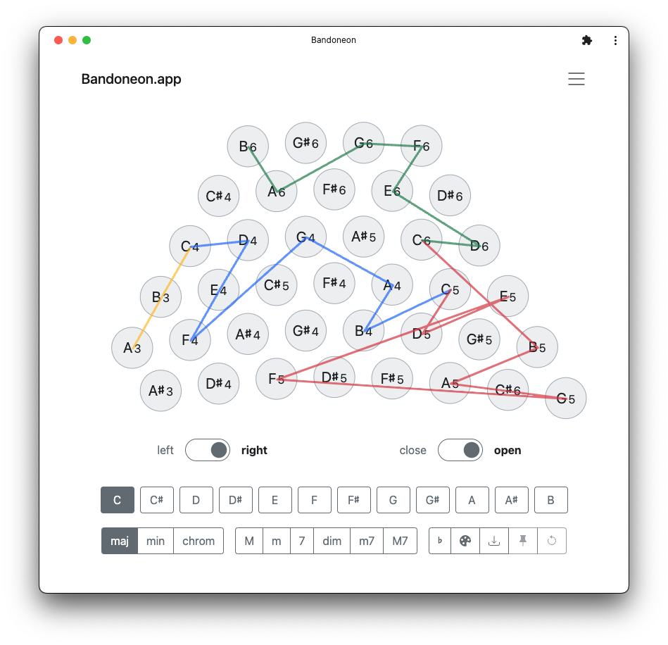

# [Bandoneon](http://bandoneon.app)

A little JavaScript application that wants to help learning the bandoneon.

## Building

    npm install
    npm run build

## Start development server

    npm run dev

## Running as Docker container

    docker run -d -p 80:80 nicokaiser/bandoneon

## Author

### Nico Kaiser

- https://twitter.com/nicokaiser
- https://kaiser.me
- https://github/nicokaiser

## Related projects

- [Keyboard Accordion](https://github.com/taniarascia/accordion) by [taniarascia](https://github.com/taniarascia) lets you play the 3-row diatonic button accordion with your computer keyboard

## License

[MIT](LICENSE)
